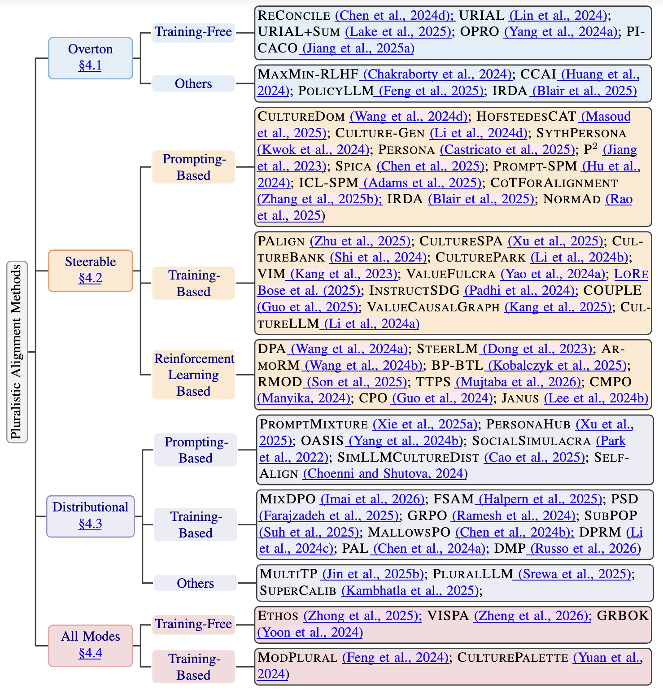
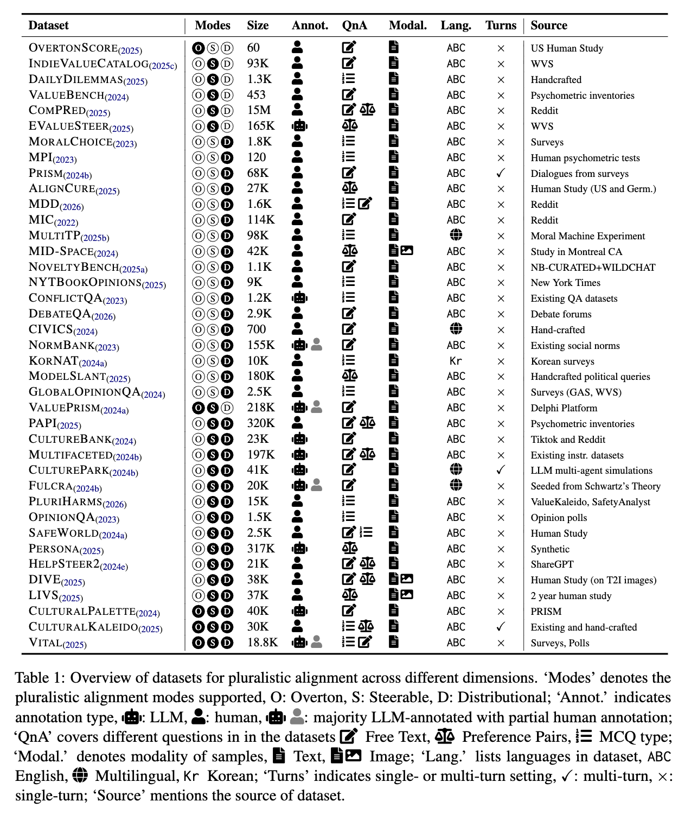

# Towards Pluralistic Alignment of LLMs: A Comprehensive Survey

[](https://awesome.re)

TODO: add paper link

This repository collects awesome surveys, resources, and papers for Pluralistic Alignment in Large Language Models.

[//]: # (The first systematic survey dedicated to Pluralistic Alignment! ✨)


**Welcome to contribute to this survey by submitting a pull request or opening an issue!**

***

## Table of Contents


- [Pluralistic Alignment Methodologies](#pluralistic-alignment-methodologies)
  - [Overton](#overton)
    - [Training-Free](#training-free)
    - [Others](#others)
  - [Steerable](#steerable)
    - [Prompting-Based](#prompting-based)
    - [Training-Based](#training-based)
    - [Reinforcement Learning-Based](#reinforcement-learning-based)
  - [Distributional](#distributional)
      - [Prompting-Based](#prompting-based-1)
      - [Training-Based](#training-based-1)
      - [Others](#others-1)
  - [All Modes](#all-modes)
    - [Training-Free](#training-free-1)
    - [Training-Based](#training-based-1)

- [Pluralistic Alignment Datasets and Benchmarks](#pluralistic-alignment-datasets-and-benchmarks)
  - [Alignment Modes](#alignment-modes)
    - [All Modes Supported](#all-modes-supported)
    - [Multiple Modes Supported](#multiple-modes-supported)
    - [Single Mode Supported](#single-mode-supported)
  - [Image / Other Modality](#other-modalities)
  - [Non-English Languages](#non-english-languages)
  - [Multi-Turns](#multi-turns)

- [Other Alignment Surveys](#other-alignment-surveys)

- [Reference](#reference)


## Pluralistic Alignment Methodologies



### Overton

#### Training-Free
* **ReConcile: Round-Table Conference Improves Reasoning via Consensus among Diverse LLMs** [[paper](https://aclanthology.org/2024.acl-long.381/)]
* **The Unlocking Spell on Base LLMs: Rethinking Alignment via In-Context Learning** [[paper](https://arxiv.org/abs/2312.01552)]
* **From Distributional to Overton Pluralism: Investigating Large Language Model Alignment** [[paper](https://aclanthology.org/2025.naacl-long.346/)]
* **Large Language Models as Optimizers** [[paper](https://openreview.net/forum?id=Bb4VGOWELI)]
* **PICACO: Pluralistic In-Context Value Alignment of LLMs via Total Correlation Optimization** [[paper](https://arxiv.org/abs/2507.16679)]


#### Others
* **MaxMin-RLHF: Alignment with Diverse Human Preferences** [[paper](https://arxiv.org/abs/2402.08925)]
* **Black-Box Prompt Optimization: Aligning Large Language Models  without Model Training** [[paper](https://aclanthology.org/2024.acl-long.176/)]
* **Policy Prototyping for LLMs: Pluralistic Alignment via Interactive and Collaborative Policymaking** [[paper](https://arxiv.org/abs/2409.08622)]
* **Reflective Verbal Reward Design for Pluralistic Alignment** [[paper](https://arxiv.org/abs/2506.17834)]

### Steerable

#### Prompting-Based
* **Not All Countries Celebrate Thanksgiving: On the Cultural Dominance in Large Language Models** [[paper](https://aclanthology.org/2024.acl-long.345/)]
* **Cultural Alignment in Large Language Models: An Explanatory Analysis Based on Hofstede’s Cultural Dimensions** [[paper](https://aclanthology.org/2025.coling-main.567/)]
* **CULTURE-GEN: Revealing Global Cultural Perception in Language Models through Natural Language Prompting** [[paper](https://arxiv.org/abs/2404.10199)]
* **Evaluating Cultural Adaptability of a Large Language Model via Simulation of Synthetic Personas** [[paper](https://arxiv.org/abs/2408.06929)]
* **PERSONA: A Reproducible Testbed for Pluralistic Alignment** [[paper](https://aclanthology.org/2025.coling-main.752/)]
* **Evaluating and Inducing Personality in Pre-trained Language Models** [[paper](https://proceedings.neurips.cc/paper_files/paper/2023/hash/21f7b745f73ce0d1f9bcea7f40b1388e-Abstract-Conference.html)]
* **SPICA: Retrieving Scenarios for Pluralistic In-Context Alignment** [[paper](https://aclanthology.org/2025.findings-acl.41.pdf)]
* **Language Models are Alignable Decision-Makers: Dataset and Application to the Medical Triage Domain** [[paper](https://aclanthology.org/2024.naacl-industry.18/)]
* **Steerable Pluralism: Pluralistic Alignment via Few-Shot Comparative Regression** [[paper](https://arxiv.org/abs/2508.08509)]
* **Exploring Chain-of-Thought Reasoning for Steerable Pluralistic Alignment** [[paper](https://aclanthology.org/2025.emnlp-main.1301/)]
* **Reflective Verbal Reward Design for Pluralistic Alignment** [[paper](https://arxiv.org/abs/2506.17834)]
* **NormAd: A Framework for Measuring the Cultural Adaptability of Large Language Models** [[paper](https://aclanthology.org/2025.naacl-long.120/)]

#### Training-Based
* **Personality Alignment of Large Language Models** [[paper](https://arxiv.org/abs/2408.11779)]
* **Self-Pluralising Culture Alignment for Large Language Models** [[paper](https://aclanthology.org/2025.naacl-long.350/)]
* **CultureBank: An Online Community-Driven Knowledge Base Towards Culturally Aware Language Technologies** [[paper](https://aclanthology.org/2024.findings-emnlp.288/)]
* **CulturePark: Boosting Cross-cultural Understanding in Large Language Models** [[paper](https://proceedings.neurips.cc/paper_files/paper/2024/hash/77f089cd16dbc36ddd1caeb18446fbdd-Abstract-Conference.html)]
* **From Values to Opinions: Predicting Human Behaviors and Stances Using Value-Injected Large Language Models** [[paper](https://aclanthology.org/2023.emnlp-main.961/)]
* **Value FULCRA: Mapping Large Language Models to the Multidimensional Spectrum of Basic Human Value** [[paper](https://aclanthology.org/2024.naacl-long.486/)]
* **LoRe: Personalizing LLMs via Low-Rank Reward Modeling** [[paper](https://arxiv.org/abs/2504.14439)]
* **Value Alignment from Unstructured Text** [[paper](https://aclanthology.org/2024.emnlp-industry.81/)]
* **Counterfactual Reasoning for Steerable Pluralistic Value Alignment of Large Language Models** [[paper](https://arxiv.org/abs/2510.18526)]
* **Are the Values of LLMs Structurally Aligned with Humans? A Causal Perspective** [[paper](https://aclanthology.org/2025.findings-acl.1188/)]
* **CultureLLM: Incorporating Cultural Differences into Large Language Models** [[paper](https://proceedings.neurips.cc/paper_files/paper/2024/hash/9a16935bf54c4af233e25d998b7f4a2c-Abstract-Conference.html)]

#### Reinforcement Learning-Based
* **Arithmetic Control of LLMs for Diverse User Preferences: Directional Preference Alignment with Multi-Objective Rewards** [[paper](https://aclanthology.org/2024.acl-long.468/)]
* **SteerLM: Attribute Conditioned SFT as an (User-Steerable) Alternative to RLHF** [[paper](https://aclanthology.org/2023.findings-emnlp.754/)]
* **Interpretable Preferences via Multi-Objective Reward Modeling and Mixture-of-Experts** [[paper](https://aclanthology.org/2024.findings-emnlp.620/)]
* **Few-shot Steerable Alignment: Adapting Rewards and LLM Policies with Neural Processes** [[paper](https://arxiv.org/abs/2412.13998)]
* **Robust Multi-Objective Controlled Decoding of Large Language Models** [[paper](https://arxiv.org/abs/2503.08796)]
* **Aligning Machiavellian Agents: Behavior Steering via Test-Time Policy Shaping** [[paper](https://ojs.aaai.org/index.php/AAAI/article/view/41109)]
* **Steerable Alignment with Conditional Multiobjective Preference Optimization** [[paper](https://dspace.mit.edu/handle/1721.1/156747)]
* **Controllable Preference Optimization: Toward Controllable Multi-Objective Alignment** [[paper](https://aclanthology.org/2024.emnlp-main.85/)]
* **Aligning to Thousands of Preferences via System Message Generalization** [[paper](https://proceedings.neurips.cc/paper_files/paper/2024/hash/86c9df30129f7663ad4d429b6f80d461-Abstract-Conference.html)]


### Distributional

#### Prompting-Based
* **Distributional Alignment for Social Simulation with LLMs: A Prompt Mixture Modeling Approach** [[paper](https://openreview.net/forum?id=6KM1siLL8a&noteId=iEGB7DPMH4)]
* **Self-Pluralising Culture Alignment for Large Language Models** [[paper](https://aclanthology.org/2025.naacl-long.350/)]
* **OASIS: Open Agent Social Interaction Simulations with One Million Agents** [[paper](https://arxiv.org/abs/2411.11581)]
* **Social Simulacra: Creating Populated Prototypes for Social Computing Systems** [[paper](https://dl.acm.org/doi/abs/10.1145/3526113.3545616)]
* **Specializing Large Language Models to Simulate Survey Response Distributions for Global Populations** [[paper](https://aclanthology.org/2025.naacl-long.162/)]
* **Self-Alignment: Improving Alignment of Cultural Values in LLMs via In-Context Learning** [[paper](https://arxiv.org/abs/2408.16482)]

#### Training-Based
* **MixDPO: Modeling Preference Strength for Pluralistic Alignment** [[paper](https://arxiv.org/abs/2601.06180)]
* **Pairwise Calibrated Rewards for Pluralistic Alignment** [[paper](https://arxiv.org/abs/2506.06298)]
* **Imitation Beyond Expectation Using Pluralistic Stochastic Dominance** [[paper](https://openreview.net/forum?id=YX5DHa9OfX)]
* **Group Robust Preference Optimization in Reward-free RLHF** [[paper](https://proceedings.neurips.cc/paper_files/paper/2024/hash/4147dfaa46cd7e20a2aecb91097ae8cc-Abstract-Conference.html)]
* **Language Model Fine-Tuning on Scaled Survey Data for Predicting Distributions of Public Opinions** [[paper](https://aclanthology.org/2025.acl-long.1028/)]
* **MallowsPO: Fine-Tune Your LLM with Preference Dispersions** [[paper](https://arxiv.org/abs/2405.14953)]
* **Aligning Crowd Feedback via Distributional Preference Reward Modeling** [[paper](https://arxiv.org/abs/2402.09764)]
* **PAL: Pluralistic Alignment Framework for Learning from Heterogeneous Preferences** [[paper](https://arxiv.org/abs/2406.08469)]
* **The Pluralistic Moral Gap: Understanding Moral Judgment and Value Differences between Humans and Large Language Models** [[paper](https://aclanthology.org/2026.eacl-long.305/)]


#### Others
* **Language Model Alignment in Multilingual Trolley Problems** [[paper](https://arxiv.org/abs/2407.02273)]
* **PluralLLM: Pluralistic Alignment in LLMs via Federated Learning** [[paper](https://dl.acm.org/doi/abs/10.1145/3722570.3726898)]
* **Improving the Distributional Alignment of LLMs using Supervision** [[paper](https://arxiv.org/abs/2507.00439)]

### All Modes

#### Training-Free
* **Pluralistic Alignment for Healthcare: A Role-Driven Framework** [[paper](https://aclanthology.org/2025.emnlp-main.1596/)]
* **VISPA: Pluralistic Alignment via Automatic Value Selection and Activation** [[paper](https://arxiv.org/abs/2601.12758)]
* **Group Robust Best-of-K Decoding of Language Models for Pluralistic Alignment** [[paper](https://openreview.net/forum?id=JI6j4NUGHv)]

#### Training-Based
* **Modular Pluralism: Pluralistic Alignment via Multi-LLM Collaboration** [[paper](https://aclanthology.org/2024.emnlp-main.240/)]
* **Cultural Palette: Pluralising Culture Alignment via Multi-agent Palette** [[paper](https://arxiv.org/abs/2412.11167)]

## Pluralistic Alignment Datasets and Benchmarks




### Alignment Modes

#### All Modes Supported
* **Cultural Palette: Pluralising Culture Alignment via Multi-agent Palette** [[paper](https://arxiv.org/abs/2412.11167)]
* **Navigating the Cultural Kaleidoscope: A Hitchhiker’s Guide to Sensitivity in Large Language Models** [[paper](https://aclanthology.org/2025.naacl-long.388/)]
* **VITAL: A New Dataset for Benchmarking Pluralistic Alignment in Healthcare** [[paper](https://aclanthology.org/2025.acl-long.1119/)]

#### Multiple Modes Supported
* **(Overton and Steerable)** **Value Kaleidoscope: Engaging AI with Pluralistic Human Values, Rights, and Duties** [[paper](https://arxiv.org/abs/2309.00779)]
* **_Steerable and Distributional_**
  * **Personality Alignment of Large Language Models** [[paper](https://arxiv.org/abs/2408.11779)]
  * **CultureBank: An Online Community-Driven Knowledge Base Towards Culturally Aware Language Technologies** [[paper](https://aclanthology.org/2024.findings-emnlp.288/)]
  * **Aligning to Thousands of Preferences via System Message Generalization** [[paper](https://proceedings.neurips.cc/paper_files/paper/2024/hash/86c9df30129f7663ad4d429b6f80d461-Abstract-Conference.html)]
  * **CulturePark: Boosting Cross-cultural Understanding in Large Language Models** [[paper](https://proceedings.neurips.cc/paper_files/paper/2024/hash/77f089cd16dbc36ddd1caeb18446fbdd-Abstract-Conference.html)]
  * **Value FULCRA: Mapping Large Language Models to the Multidimensional Spectrum of Basic Human Value** [[paper](https://aclanthology.org/2024.naacl-long.486/)]
  * **PluriHarms: Benchmarking the Full Spectrum of Human Judgments on AI Harm** [[paper](https://arxiv.org/abs/2601.08951)]
  * **Whose Opinions Do Language Models Reflect?** [[paper](https://arxiv.org/abs/2303.17548)]
  * **SafeWorld: Geo-Diverse Safety Alignment** [[paper](https://proceedings.neurips.cc/paper_files/paper/2024/hash/e8aad0aaa1309659a7d7e4c21202d9d0-Abstract-Conference.html)]
  * **PERSONA: A Reproducible Testbed for Pluralistic Alignment** [[paper](https://aclanthology.org/2025.coling-main.752/)]
  * **HelpSteer 2: Open-source dataset for training top-performing reward models** [[paper](https://proceedings.neurips.cc/paper_files/paper/2024/hash/02fd91a387a6a5a5751e81b58a75af90-Abstract-Datasets_and_Benchmarks_Track.html)]
  * **Whose View of Safety? A Deep DIVE Dataset for Pluralistic Alignment of Text-to-Image Models** [[paper](https://arxiv.org/abs/2507.13383)]
  * **LIVS: A Pluralistic Alignment Dataset for Inclusive Public Spaces** [[paper](https://arxiv.org/abs/2503.01894)]

##### Single Mode Supported
###### Overton
* **Benchmarking Overton Pluralism in LLMs** [[paper](https://arxiv.org/abs/2512.01351)]

###### Steerable
* **Can Language Models Reason about Individualistic Human Values and Preferences?** [[paper](https://aclanthology.org/2025.acl-long.336/)]
* **DailyDilemmas: Revealing Value Preferences of LLMs with Quandaries of Daily Life** [[paper](https://arxiv.org/abs/2410.02683)]
* **ValueBench: Towards Comprehensively Evaluating Value Orientations and Understanding of Large Language Models** [[paper](https://aclanthology.org/2024.acl-long.111/)]
* **ComPO: Community Preferences for Language Model Personalization** [[paper](https://aclanthology.org/2025.naacl-long.419/)]
* **EVALUESTEER: Measuring Reward Model Steerability Towards Values and Preferences** [[paper](https://arxiv.org/abs/2510.06370)]


###### Distributional
* **Evaluating and Inducing Personality in Pre-trained Language Models** [[paper](https://arxiv.org/abs/2206.07550)]
* **The PRISM Alignment Dataset: What Participatory, Representative and Individualised Human Feedback Reveals About the Subjective and Multicultural Alignment of Large Language Models** [[paper](https://proceedings.neurips.cc/paper_files/paper/2024/hash/be2e1b68b44f2419e19f6c35a1b8cf35-Abstract-Datasets_and_Benchmarks_Track.html)]
* **A Sociotechnical Perspective on Aligning AI with Pluralistic Human Values** [[paper](https://openreview.net/forum?id=oSRqZO2O2O)]
* **The Pluralistic Moral Gap: Understanding Moral Judgment and Value Differences between Humans and Large Language Models** [[paper](https://aclanthology.org/2026.eacl-long.305/)]
* **The Moral Integrity Corpus: A Benchmark for Ethical Dialogue Systems** [[paper](https://aclanthology.org/2022.acl-long.261/)]
* **Language Model Alignment in Multilingual Trolley Problems** [[paper](https://arxiv.org/abs/2407.02273)]
* **MID-Space: Aligning Diverse Communities' Needs to Inclusive Public Spaces** [[paper](https://openreview.net/forum?id=kyfkMRT4Ao)]
* **NoveltyBench: Evaluating Language Models for Humanlike Diversity** [[paper](https://arxiv.org/abs/2504.05228)]
* **Benchmarking Distributional Alignment of Large Language Models** [[paper](https://aclanthology.org/2025.naacl-long.2/)]
* **Adaptive Chameleon or Stubborn Sloth: Revealing the Behavior of Large Language Models in Knowledge Conflicts** [[paper](https://arxiv.org/abs/2305.13300)]
* **CIVICS: Building a Dataset for Examining Culturally-Informed Values in Large Language Models** [[paper](https://ojs.aaai.org/index.php/AIES/article/view/31710)]
* **NormBank: A Knowledge Bank of Situational Social Norms** [[paper](https://aclanthology.org/2023.acl-long.429/)]
* **KorNAT: LLM Alignment Benchmark for Korean Social Values and Common Knowledge** [[paper](https://aclanthology.org/2024.findings-acl.666/)]
* **Measuring Perceived Slant in Large Language Models  Through User Evaluations** [[paper](https://modelslant.com/paper.pdf)]
* **Towards Measuring the Representation of Subjective Global Opinions in Language Models** [[paper](https://arxiv.org/abs/2306.16388)]


### Other Modalities
* **MID-Space: Aligning Diverse Communities' Needs to Inclusive Public Spaces** [[paper](https://openreview.net/forum?id=kyfkMRT4Ao)]
* **Whose View of Safety? A Deep DIVE Dataset for Pluralistic Alignment of Text-to-Image Models** [[paper](https://arxiv.org/abs/2507.13383)]
* **LIVS: A Pluralistic Alignment Dataset for Inclusive Public Spaces** [[paper](https://arxiv.org/abs/2503.01894)]


### Non-English Languages
* **Language Model Alignment in Multilingual Trolley Problems** [[paper](https://arxiv.org/abs/2407.02273)]
* **CIVICS: Building a Dataset for Examining Culturally-Informed Values in Large Language Models** [[paper](https://ojs.aaai.org/index.php/AIES/article/view/31710)]
* **KorNAT: LLM Alignment Benchmark for Korean Social Values and Common Knowledge** [[paper](https://aclanthology.org/2024.findings-acl.666/)]
* **CulturePark: Boosting Cross-cultural Understanding in Large Language Models** [[paper](https://proceedings.neurips.cc/paper_files/paper/2024/hash/77f089cd16dbc36ddd1caeb18446fbdd-Abstract-Conference.html)]
* **Value FULCRA: Mapping Large Language Models to the Multidimensional Spectrum of Basic Human Value** [[paper](https://aclanthology.org/2024.naacl-long.486/)]
  

### Multi-Turns
* **The PRISM Alignment Dataset: What Participatory, Representative and Individualised Human Feedback Reveals About the Subjective and Multicultural Alignment of Large Language Models** [[paper](https://proceedings.neurips.cc/paper_files/paper/2024/hash/be2e1b68b44f2419e19f6c35a1b8cf35-Abstract-Datasets_and_Benchmarks_Track.html)]
* **CulturePark: Boosting Cross-cultural Understanding in Large Language Models** [[paper](https://proceedings.neurips.cc/paper_files/paper/2024/hash/77f089cd16dbc36ddd1caeb18446fbdd-Abstract-Conference.html)]
* **Navigating the Cultural Kaleidoscope: A Hitchhiker’s Guide to Sensitivity in Large Language Models** [[paper](https://aclanthology.org/2025.naacl-long.388/)]


## Other Alignment Surveys


* **Towards Scalable Automated Alignment of LLMs: A Survey** [[paper](https://arxiv.org/abs/2406.01252)]
* **Large Language Model Alignment: A Survey** [[paper](https://arxiv.org/abs/2309.15025)]
* **AI Alignment: A Comprehensive Survey** [[paper](https://arxiv.org/abs/2310.19852)]
* **Aligning Multimodal LLM with Human Preference: A Survey** [[paper](https://arxiv.org/abs/2503.14504)]
* **Large Vision-Language Model Alignment and Misalignment: A Survey Through the Lens of Explainability** [[paper](https://aclanthology.org/anthology-files/anthology-files/pdf/findings/2025.findings-emnlp.90.pdf)]
* **A Survey of Progress in LLM Alignment from the Perspective of Reward Design** [[paper](https://ieeexplore.ieee.org/abstract/document/11361384)]
* **Survey of Cultural Awareness in Language Models: Text and Beyond Open Access** [[paper](https://direct.mit.edu/coli/article/51/3/907/130804/Survey-of-Cultural-Awareness-in-Language-Models)]
* **Personalization of Large Language Models: A Survey** [[paper](https://arxiv.org/abs/2411.00027)]
* **A Survey on Personalized and Pluralistic Preference Alignment in Large Language Models** [[paper](https://arxiv.org/abs/2504.07070)]


## Reference


```
TODO: add bibtex for paper
```
